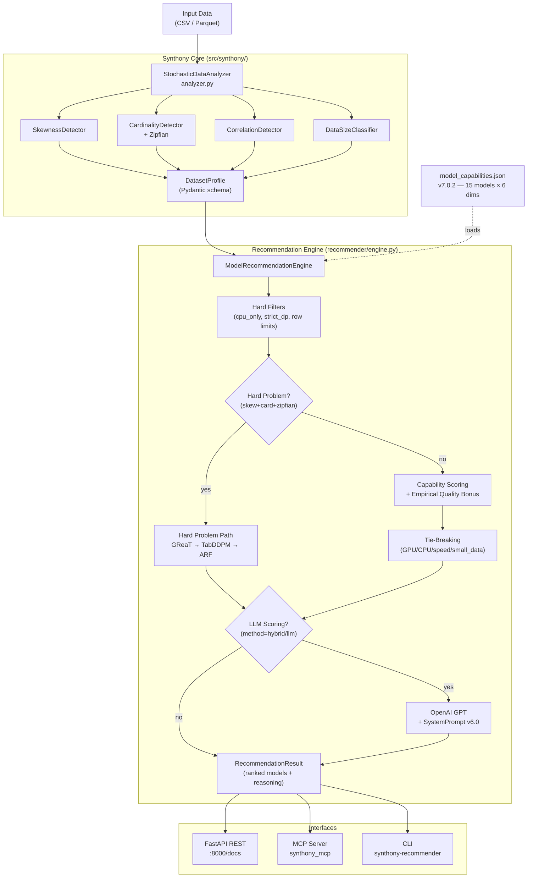
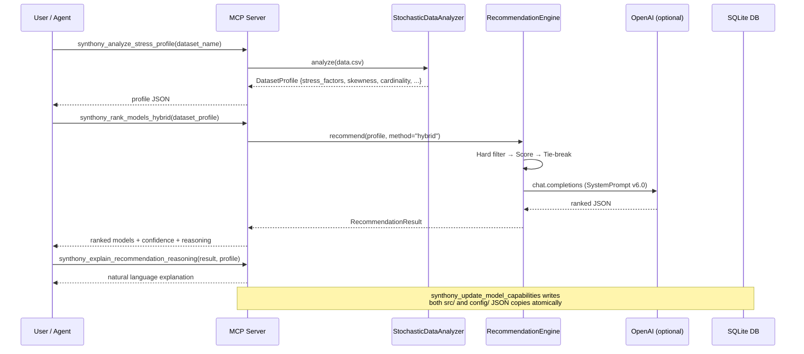
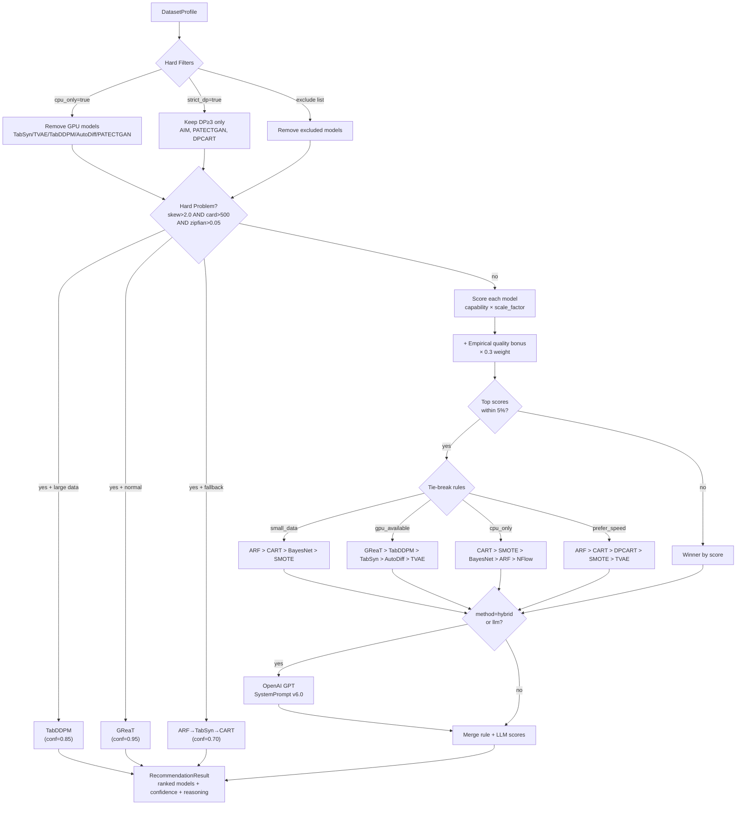
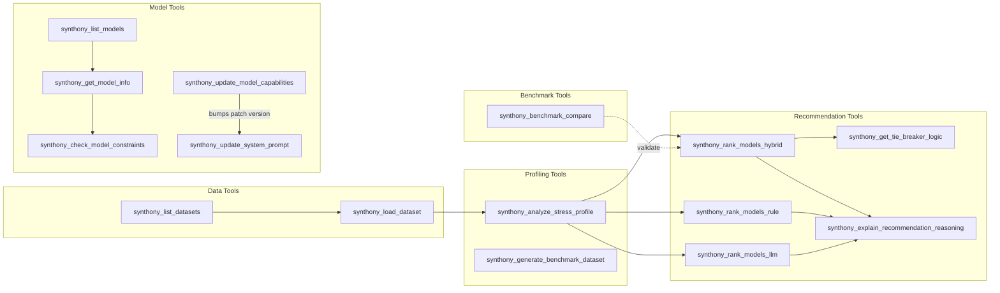

# Synthony

**Orchestrating the right synthetic data model for your tabular data.**

[](https://openreview.net/forum?id=cj4SNumWqf)
[](https://www.python.org/downloads/)
[](LICENSE.md)

Synthony is an intelligent orchestration platform that analyzes your tabular dataset's statistical characteristics ("stress factors") and recommends the optimal synthetic data generation model from 15 state-of-the-art options. Like a symphony conductor, Synthony ensures the right model plays the right role for your data.

> **Published at the 2nd DeLTa Workshop, ICLR 2026**
> [Paper](https://openreview.net/forum?id=cj4SNumWqf) | [Code](https://github.com/UCLA-Trustworthy-AI-Lab/Synthony)

---

## Why Synthony?

Choosing the right synthetic data model is non-trivial. Each model family has distinct failure modes:

| Model Family | Common Failure Mode |
|---|---|
| GANs | Collapse on skewed distributions |
| VAEs | Mode collapse on high-cardinality columns |
| LLMs (GReaT) | Too slow and memory-intensive for large datasets |
| Tree-based | Miss complex cross-column correlations |
| Diffusion | High GPU cost, slow to train on small data |

Synthony solves this by:

1. **Profiling** your data to detect statistical stress factors
2. **Scoring** those factors against a calibrated model capability registry
3. **Recommending** the best model with hard constraints and clear reasoning

---

## Architecture Overview



---

## Data Flow: End-to-End



---

## Features

### Stress Detection

| Factor | Threshold | Impact |
|---|---|---|
| Severe Skew | \|skewness\| > 2.0 | Breaks GANs / VAEs |
| High Cardinality | unique > 500 | Mode collapse risk |
| Zipfian Distribution | Top 20% > 80% of mass | Requires specialized tokenization |
| Small Data | rows < 1,000 | Overfitting risk |
| Large Data | rows > 50,000 | LLMs impractical |

### Model Registry (v7.0.2 — 15 Models)

Capability scores 0–4 calibrated from spark benchmarks (10 datasets):

| Model | Type | GPU | Skew | Card | Zipfian | Small | Corr | DP | Quality |
|---|---|---|---|---|---|---|---|---|---|
| CART | Tree | no | 3 | 4 | 2 | 4 | 4 | 0 | 0.981 |
| SMOTE | Statistical | no | 3 | 4 | 2 | 4 | 4 | 0 | 0.979 |
| BayesianNetwork | Statistical | no | 3 | 4 | 2 | 4 | 3 | 0 | 0.971 |
| ARF | Tree | no | 2 | 4 | 3 | 4 | 4 | 0 | 0.962 |
| NFlow | Flow | no | 2 | 4 | 2 | 4 | 1 | 0 | 0.915 |
| TVAE | VAE | yes | 2 | 4 | 1 | 3 | 4 | 0 | 0.865 |
| TabSyn | Diffusion | yes | 2 | 4 | 3 | 3 | 2 | 0 | 0.848 |
| CTGAN | GAN | no | 1 | 4 | 2 | 2 | 3 | 0 | 0.809 |
| DPCART | Tree+DP | no | 2 | 0 | 2 | 2 | 3 | 3 | 0.759 |
| TabDDPM | Diffusion | yes | 1 | 2 | 2 | 2 | 3 | 0 | 0.697 |
| AutoDiff | Diffusion | yes | 1 | 3 | 2 | 2 | 1 | 0 | 0.634 |
| AIM | Stat+DP | no | 3 | 0 | 1 | 2 | 3 | 4 | 0.540 |
| PATECTGAN | GAN+DP | yes | 0 | 4 | 2 | 1 | 0 | 4 | 0.455 |
| GReaT | LLM | yes | 4 | 4 | 4 | 2 | 3 | 0 | N/A† |
| Identity | Baseline | no | 4 | 4 | 4 | 4 | 4 | 0 | 0.989* |

*Identity is a passthrough baseline for testing only.
†GReaT scores are literature-derived, not empirically validated.

---

## Installation

```bash
pip install -e .                   # Core only
pip install -e ".[cli]"            # CLI tools
pip install -e ".[api]"            # FastAPI REST server
pip install -e ".[llm]"            # LLM recommendations (requires OPENAI_API_KEY)
pip install -e ".[mcp]"            # MCP server
pip install -e ".[all]"            # Everything
pip install -e ".[dev]"            # Development tools
```

---

## Quick Start

### Python API

```python
from synthony import StochasticDataAnalyzer
from synthony.recommender.engine import ModelRecommendationEngine

analyzer = StochasticDataAnalyzer()
profile = analyzer.analyze("data.csv")

print(f"Severe skew: {profile.stress_factors.severe_skew}")
print(f"High cardinality: {profile.stress_factors.high_cardinality}")

engine = ModelRecommendationEngine()
result = engine.recommend(profile, method="rule_based")
print(f"Recommended: {result.recommended_model.model_name}")
print(f"Confidence: {result.confidence:.2f}")

# With intent conditioning
result = engine.recommend(profile, method="rule_based", focus="privacy")

# With hard constraints
result = engine.recommend(profile, method="hybrid",
                          constraints={"cpu_only": True, "strict_dp": True})
```

### CLI

```bash
# Profile a dataset
synthony-profile data.csv --verbose
synthony-profile data.csv -o profile.json

# Get a model recommendation
synthony-recommender -i data.csv --method hybrid
synthony-recommender -i data.csv --method rulebased --cpu-only
synthony-recommender -i data.csv --method llm --strict-dp

# Benchmark synthetic vs original
synthony-benchmark -r original.csv -s synthetic.csv --verbose
synthony-benchmark -r original.csv -s synthetic.csv -o results.json
```

### REST API

```bash
# Start the server
synthony-api
# or: uvicorn synthony.api.server:app --reload

# Visit http://localhost:8000/docs for interactive API docs

# Analyze and recommend in one call
curl -X POST "http://localhost:8000/analyze-and-recommend" \
  -F "file=@data.csv" \
  -F "method=hybrid"
```

### MCP Server (AI Agent Integration)

```bash
# Install with MCP support
pip install -e ".[mcp]"

# Start the server
synthony-mcp
# or: python -m mcp_server.server --verbose

# Test the protocol
echo '{"jsonrpc":"2.0","method":"tools/list","params":{},"id":1}' \
  | python -m mcp_server.server
```

**Claude Desktop integration (`~/Library/Application Support/Claude/claude_desktop_config.json`):**

```json
{
  "mcpServers": {
    "synthony": {
      "command": "synthony-mcp",
      "env": {
        "SYNTHONY_DATA_DIR": "/path/to/your/datasets"
      }
    }
  }
}
```

---

## Recommendation Engine: Decision Logic



---

## MCP Server Tool Map



---

## Environment Variables

| Variable | Purpose |
|---|---|
| `SYNTHONY_DATA_DIR` | Dataset directory (default: `dataset/input_data`) |
| `OPENAI_API_KEY` | Required for LLM-based recommendations |
| `MCP_DEBUG` | Set to any non-empty value to enable verbose MCP server logging |

---

## Project Structure

```
Synthony/
├── src/synthony/
│   ├── core/           # DataLoader, StochasticDataAnalyzer, schemas, errors
│   ├── detectors/      # SkewnessDetector, CardinalityDetector, CorrelationDetector, DataSizeClassifier
│   ├── recommender/    # ModelRecommendationEngine, focus_profiles, model_capabilities.json
│   ├── benchmark/      # DataQualityBenchmark, metrics
│   ├── api/            # FastAPI server, database, storage, security
│   ├── cli.py          # CLI entry points
│   └── utils/          # AnalyzerConfig, constants
├── mcp_server/
│   ├── server.py       # MCP server entry point (SynthonyMCPServer)
│   └── tools/          # data_tools, profiling_tools, model_tools, recommendation_tools, benchmark_tools
├── config/
│   ├── model_capabilities.json  # Canonical registry v7.0.2 (15 models)
│   └── SystemPrompt.md          # LLM system prompt v6.0
├── tests/
│   ├── unit/           # Detector and engine unit tests
│   ├── integration/    # End-to-end pipeline tests
│   ├── functional/     # CLI, API, and MCP functional tests
│   ├── evaluation/     # Recommendation accuracy evaluation
│   └── regression/     # Baseline and schema regression tests
├── docs/               # Architecture docs, scoring methodology, API guides
├── scripts/            # Bayesian optimization, benchmark runners, analysis scripts
└── ablation/           # Ablation study runner and results
```

---

## Scoring Methodology

Capability scores are derived empirically from preservation rates across 10 benchmark datasets:

| Score | Threshold | Meaning |
|---|---|---|
| 4 | preservation ≥ 0.90 | Excellent |
| 3 | preservation ≥ 0.75 | Good |
| 2 | preservation ≥ 0.50 | Moderate |
| 1 | preservation ≥ 0.25 | Poor |
| 0 | preservation < 0.25 | Fails |

Cardinality uses a density-normalized formula: `(synth_unique / synth_rows) / (orig_unique / orig_rows)` to correct for row-count sampling bias. Full methodology: [`docs/scoring_methodology.md`](docs/scoring_methodology.md).

---

## Development

```bash
# Install development dependencies
pip install -e ".[dev]"

# Code quality
black src/ tests/
ruff check src/ tests/
mypy src/

# Run all tests
pytest

# Unit tests only
pytest tests/unit/ -v

# Exclude LLM-dependent tests (no API key required)
pytest -m "not requires_llm"

# Coverage report
pytest --cov=synthony --cov-report=html
```

---

## Roadmap

- [ ] PyPI package publication
- [ ] Learned capability embeddings (replacing hand-crafted registry)
- [ ] Expanded benchmark suite (20+ datasets)
- [ ] Web frontend for dataset upload and visualization

---

## Contributing

Contributions are welcome. See [`CLAUDE.md`](CLAUDE.md) for architecture details and [`AGENTS.md`](AGENTS.md) for coding agent guidelines.

---

## License

MIT-NC (MIT Non-Commercial) — free for academic and research use with attribution. Commercial use requires prior written authorization. See [LICENSE.md](LICENSE.md).

For commercial licensing: ohsono@gmail.com / hochanson@g.ucla.edu

---

## Citation

```bibtex
@inproceedings{son2026synthony,
  title     = {{SYNTHONY}: A Stress-Aware, Intent-Conditioned Agent for Deep
               Tabular Generative Model Selection},
  author    = {Hochan Son and Xiaofeng Lin and Jason Ni and Guang Cheng},
  booktitle = {ICLR 2026 2nd Workshop on Deep Generative Model in Machine
               Learning: Theory, Principle and Efficacy (DeLTa)},
  year      = {2026},
  url       = {https://openreview.net/forum?id=cj4SNumWqf}
}
```

## Team

All authors are members of the **UCLA Trustworthy AI Lab**.

- **Hochan Son** — ohsono@gmail.com / hochanson@g.ucla.edu
- **Xiaofeng Lin** — Bernardo1998@g.ucla.edu
- **Jason Ni** — jasonni19@g.ucla.edu
- **Guang Cheng** (PI) — guangcheng@g.ucla.edu
