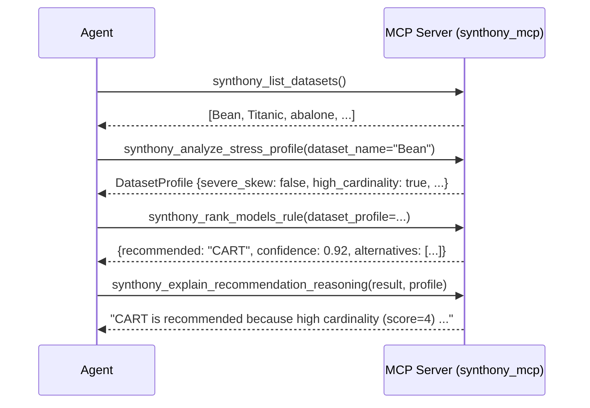
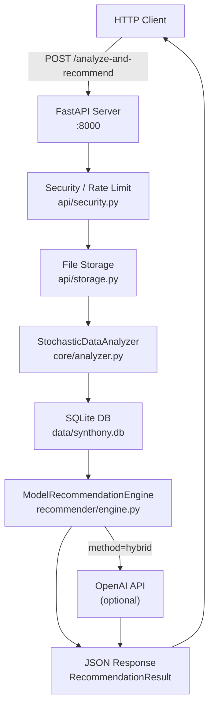
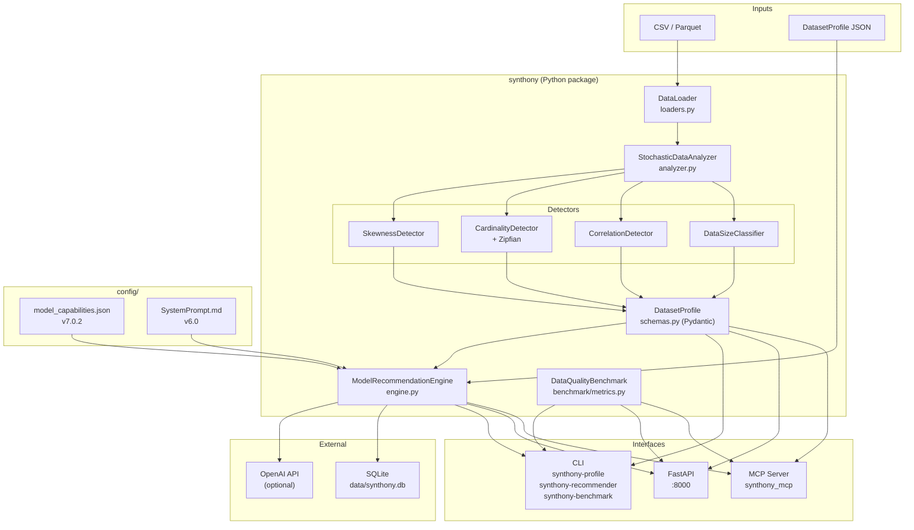
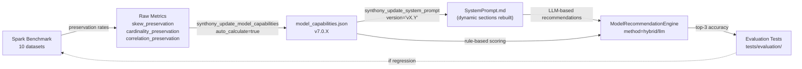

# Synthony Server Guide

Reference for all three Synthony server interfaces: **MCP Server**, **REST API**, and **CLI**. Includes setup, usage examples, architectural diagrams, and troubleshooting.

---

## Table of Contents

1. [Which Interface Should I Use?](#which-interface-should-i-use)
2. [Installation](#installation)
3. [MCP Server](#mcp-server)
4. [REST API (FastAPI)](#rest-api-fastapi)
5. [CLI](#cli)
6. [Architecture Diagrams](#architecture-diagrams)
7. [Troubleshooting](#troubleshooting)

---

## Which Interface Should I Use?

| Interface | Best For |
|---|---|
| **MCP Server** | AI agents (Claude Desktop, Claude Code, Cursor, Cline, Continue.dev) |
| **REST API** | Web applications, microservices, programmatic HTTP clients |
| **CLI** | One-off profiling, scripting, CI pipelines |
| **Python SDK** | Library use within your own Python code |

---

## Installation

```bash
# Core library only
pip install -e .

# With specific interface
pip install -e ".[mcp]"    # MCP server
pip install -e ".[api]"    # REST API
pip install -e ".[cli]"    # CLI tools
pip install -e ".[llm]"    # LLM recommendations (requires OPENAI_API_KEY)

# Everything
pip install -e ".[all]"
```

---

## MCP Server

The MCP server exposes Synthony's capabilities via **JSON-RPC 2.0 over stdio** transport. It is the primary integration path for AI agents.

### Start the Server

```bash
# Via entry point (recommended)
synthony-mcp

# Via module (with verbose logging)
python -m mcp_server.server --verbose

# Via environment variable (verbose without flag)
MCP_DEBUG=1 synthony-mcp
```

### Platform Integration

#### Claude Desktop (macOS)

Edit `~/Library/Application Support/Claude/claude_desktop_config.json`:

```json
{
  "mcpServers": {
    "synthony": {
      "command": "synthony-mcp",
      "env": {
        "SYNTHONY_DATA_DIR": "/absolute/path/to/datasets"
      }
    }
  }
}
```

Restart Claude Desktop. You can now ask:
> "Analyze the Bean dataset and recommend the best synthetic data model"

#### Claude Code (`.mcp.json` in project root)

```json
{
  "mcpServers": {
    "synthony": {
      "command": "python",
      "args": ["-m", "mcp_server.server"],
      "cwd": "/path/to/Synthony"
    }
  }
}
```

#### Cline (VS Code) — `.cline/config.json`

```json
{
  "mcpServers": {
    "synthony": {
      "command": "synthony-mcp"
    }
  }
}
```

#### Continue.dev (VS Code) — `.continue/config.json`

```json
{
  "mcpServers": [
    {
      "name": "synthony",
      "command": "synthony-mcp"
    }
  ]
}
```

#### Cursor

Settings → MCP Servers → Add Server:
- Command: `synthony-mcp`
- Name: `synthony`

### Available Tools

#### Data Tools

| Tool | Purpose | Key Arguments |
|---|---|---|
| `synthony_list_datasets` | List datasets in `SYNTHONY_DATA_DIR` | `format_filter` (csv/parquet/all) |
| `synthony_load_dataset` | Load dataset metadata + preview | `dataset_name` (required) |

#### Profiling Tools

| Tool | Purpose | Key Arguments |
|---|---|---|
| `synthony_analyze_stress_profile` | Extract stress factors and column analysis | `dataset_name` OR `data_path` (one required) |
| `synthony_generate_benchmark_dataset` | Create test datasets with known stress | `dataset_type`, `output_path` |

#### Model Tools

| Tool | Purpose | Key Arguments |
|---|---|---|
| `synthony_list_models` | List all 15 models | `model_type`, `cpu_only`, `requires_dp` |
| `synthony_get_model_info` | Full model specification | `model_name` (required) |
| `synthony_check_model_constraints` | Compatible models for dataset size | `row_count` |
| `synthony_update_model_capabilities` | Update scores in model_capabilities.json | `model_name`, `capabilities`, `spark_empirical`, `auto_calculate` |
| `synthony_update_system_prompt` | Regenerate SystemPrompt.md from JSON | `version` (required), `set_active`, `version_note` |

#### Recommendation Tools

| Tool | Purpose | Key Arguments |
|---|---|---|
| `synthony_rank_models_hybrid` | Rule + LLM ranking | `dataset_profile` (required) |
| `synthony_rank_models_rule` | Rule-based only (no API key) | `dataset_profile` (required) |
| `synthony_rank_models_llm` | LLM-based only | `dataset_profile` (required), needs `OPENAI_API_KEY` |
| `synthony_get_tie_breaker_logic` | Resolve ties within 5% | `tied_models`, `dataset_profile` |
| `synthony_explain_recommendation_reasoning` | Natural language explanation | `recommendation_result`, `dataset_profile` |

#### Benchmark Tools

| Tool | Purpose | Key Arguments |
|---|---|---|
| `synthony_benchmark_compare` | Compare original vs synthetic quality | `original_path`, `synthetic_path` |

### Protocol Testing

```bash
# List all tools
echo '{"jsonrpc":"2.0","method":"tools/list","params":{},"id":1}' \
  | python -m mcp_server.server

# Call a tool
echo '{"jsonrpc":"2.0","method":"tools/call","params":{"name":"synthony_list_datasets","arguments":{}},"id":2}' \
  | python -m mcp_server.server

# List resources
echo '{"jsonrpc":"2.0","method":"resources/list","params":{},"id":3}' \
  | python -m mcp_server.server

# Read model registry
echo '{"jsonrpc":"2.0","method":"resources/read","params":{"uri":"models://registry"},"id":4}' \
  | python -m mcp_server.server
```

### Available Resources

| URI | Content |
|---|---|
| `models://registry` | Complete model catalog (capability scores, constraints) |
| `models://model/{name}` | Single model details (e.g. `models://model/ARF`) |
| `datasets://profiles/{id}` | Cached dataset profiles from previous analyses |
| `benchmarks://thresholds` | Stress detection thresholds |
| `guidelines://system-prompt` | Active LLM system prompt (from database) |

### Typical Agent Workflow



---

## REST API (FastAPI)

The REST API exposes Synthony over HTTP. Useful for web applications and services that cannot use stdio-based MCP.

### Start the Server

```bash
# Via entry point
synthony-api

# Via uvicorn (with reload for development)
uvicorn synthony.api.server:app --reload --host 0.0.0.0 --port 8000

# Via Docker
docker build -t synthony .
docker run -p 8000:8000 synthony
```

Visit **http://localhost:8000/docs** for interactive OpenAPI documentation.

### Key Endpoints

| Method | Path | Description |
|---|---|---|
| `GET` | `/health` | Health check |
| `POST` | `/analyze` | Upload CSV → DatasetProfile |
| `POST` | `/recommend` | DatasetProfile → RecommendationResult |
| `POST` | `/analyze-and-recommend` | Upload CSV → full pipeline result |
| `GET` | `/models` | List all models |
| `GET` | `/models/{name}` | Single model details |
| `POST` | `/benchmark` | Compare original vs synthetic CSV |
| `GET` | `/systemprompt/active` | Get active LLM system prompt |
| `POST` | `/systemprompt/upload` | Upload new system prompt version |

### Examples

**Analyze and recommend in one call:**
```bash
curl -X POST "http://localhost:8000/analyze-and-recommend" \
  -F "file=@data.csv" \
  -F "method=hybrid"
```

**Rule-based recommendation with constraints:**
```bash
curl -X POST "http://localhost:8000/analyze-and-recommend" \
  -F "file=@data.csv" \
  -F "method=rule_based" \
  -F "cpu_only=true" \
  -F "strict_dp=false"
```

**Get model info:**
```bash
curl "http://localhost:8000/models/ARF"
```

**Upload system prompt:**
```bash
curl -X POST "http://localhost:8000/systemprompt/upload" \
  -F "file=@config/SystemPrompt.md" \
  -F "version=v6.0" \
  -F "set_active=true"
```

### API Request Flow



### Docker Compose (Full Stack)

```bash
docker-compose up
```

Services started:
- `synthony-api` — FastAPI on port 8000
- `synthony-mcp` — MCP server (stdio, for agent integration)

---

## CLI

The CLI provides quick profiling, recommendations, and benchmarking without writing code.

### Commands

#### `synthony-profile` — Analyze stress factors

```bash
# Basic analysis (prints to stdout)
synthony-profile data.csv

# Verbose output (shows per-column breakdown)
synthony-profile data.csv --verbose

# Save profile to JSON
synthony-profile data.csv -o profile.json

# With custom skewness threshold
synthony-profile data.csv --skew-threshold 3.0
```

#### `synthony-recommender` — Get model recommendation

```bash
# Hybrid (rule + LLM, requires OPENAI_API_KEY)
synthony-recommender -i data.csv --method hybrid

# Rule-based only (no API key needed)
synthony-recommender -i data.csv --method rulebased

# LLM-based only
synthony-recommender -i data.csv --method llm

# With constraints
synthony-recommender -i data.csv --method rulebased --cpu-only
synthony-recommender -i data.csv --method rulebased --strict-dp
synthony-recommender -i data.csv --method rulebased --cpu-only --strict-dp

# With intent (focus weights)
synthony-recommender -i data.csv --focus privacy
synthony-recommender -i data.csv --focus fidelity

# Show top N alternatives
synthony-recommender -i data.csv --top-n 5

# Save result to JSON
synthony-recommender -i data.csv -o recommendation.json
```

#### `synthony-benchmark` — Compare data quality

```bash
# Basic comparison
synthony-benchmark -r original.csv -s synthetic.csv

# Verbose output
synthony-benchmark -r original.csv -s synthetic.csv --verbose

# Save results to JSON
synthony-benchmark -r original.csv -s synthetic.csv -o results.json
```

### CLI Output Format

```
Dataset: data.csv (10,000 rows × 15 columns)

Stress Factors:
  ✓ Severe Skew (max: 4.2, columns: income, amount)
  ✗ High Cardinality
  ✓ Zipfian Distribution (top 20%: 84%)
  ✗ Small Data
  ✗ Large Data

Recommendation:
  Model:      ARF
  Confidence: 0.87
  Method:     rule_based

  Reasoning:
    - Severe skew in 2 columns — tree-based models handle skew well
    - Zipfian distribution detected — ARF's random forest handles power-law well
    - 10,000 rows is within ARF's optimal range

  Alternatives:
    2. CART      (score: 0.83)
    3. TabSyn    (score: 0.79)
```

---

## Architecture Diagrams

### System Components



### Capability Score Update Pipeline



---

## Troubleshooting

### MCP Server

**"No module named mcp_server"**
```bash
pip install -e ".[mcp]"
# Verify:
python -c "import mcp_server; print('ok')"
```

**"No active system prompt found" (LLM path)**
The SQLite database needs an active prompt entry. Initialize with:
```bash
# Start the API server once to create the DB and seed the prompt
synthony-api &
curl -X POST http://localhost:8000/systemprompt/upload \
  -F "file=@config/SystemPrompt.md" \
  -F "version=v6.0" \
  -F "set_active=true"
kill %1
# Now the MCP server's LLM path can load the prompt from DB
```

Or use the MCP tool directly (if DB already exists):
```json
{
  "name": "synthony_update_system_prompt",
  "arguments": { "version": "v6.0", "set_active": true }
}
```

**Verbose logging**
```bash
MCP_DEBUG=1 synthony-mcp
# or
python -m mcp_server.server --verbose
```

### REST API

**"Connection refused" on port 8000**
```bash
# Check if server is running
lsof -i :8000
# Start it
synthony-api
```

**Import errors on start**
```bash
pip install -e ".[api]"
```

### CLI

**"synthony-profile: command not found"**
```bash
pip install -e ".[cli]"
which synthony-profile   # should resolve to your venv
```

**OpenAI 401 error (hybrid/llm methods)**
```bash
export OPENAI_API_KEY=sk-...
synthony-recommender -i data.csv --method rulebased   # works without key
```

### General

**Both JSON files out of sync**
```bash
diff config/model_capabilities.json src/synthony/recommender/model_capabilities.json
# If different, copy canonical to runtime:
cp config/model_capabilities.json src/synthony/recommender/model_capabilities.json
```

**Test failures in functional tests**
`tests/functional/test_api_simple.py` requires the FastAPI server running. Start it first:
```bash
synthony-api &
pytest tests/functional/test_api_simple.py -v
kill %1
```
`tests/functional/test_openai_connection.py` requires a valid `OPENAI_API_KEY`.

All other test suites (`unit/`, `integration/`, `regression/`, `evaluation/`) run without external services.
