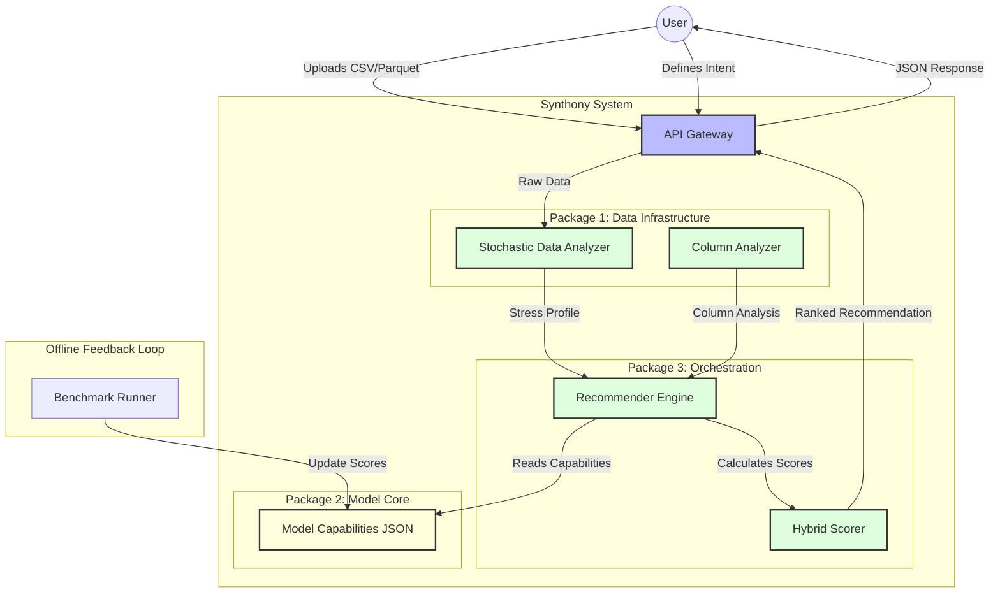
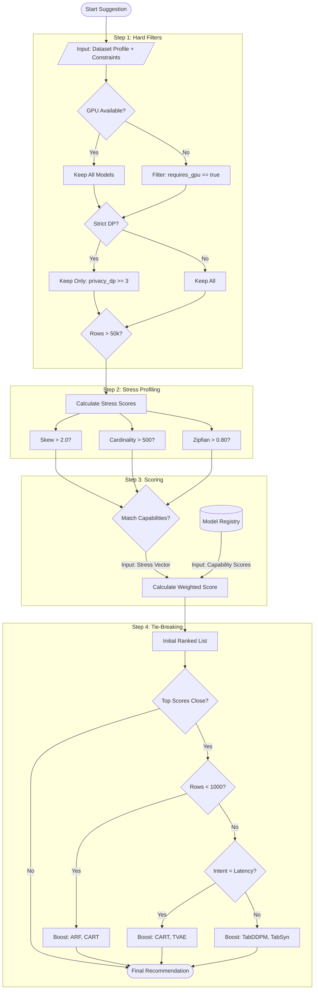

# Visual Architecture Documentation (v1)

**Date:** 2026-02-08
**Version:** 1.0

Meaningful simplification of the **Synthony** architecture and **Recommender Engine** logic.

---

## 1. Abstract Architecture (High-Level)

This view shows how the three core packages interact to transform raw data into a model recommendation.

---

## 2. Recommender Engine Logic (Detailed)

This flowchart details the decision process inside the `ModelRecommendationEngine`.

What are the stree profiles DP, tiebreaker, 